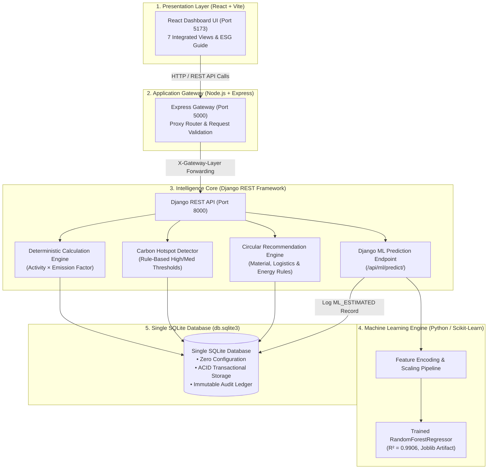
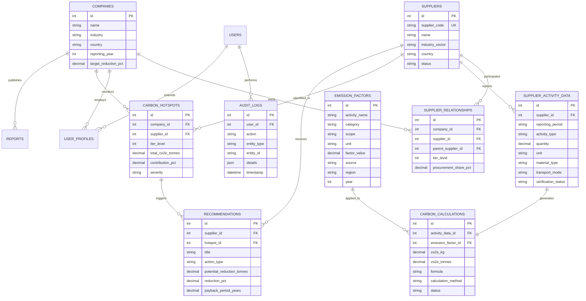
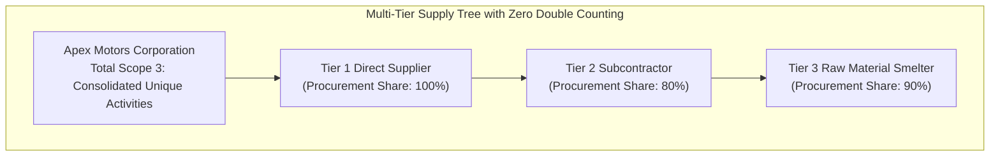

# 🌿 Carbon-Aware Supply Chain Intelligence Platform
### Enterprise Multi-Tier Scope 3 Decarbonization, Hotspot Analytics & ML Gap-Filling

[](#6-system-architecture)
[](#8-sqlite-database-architecture)
[-7c3aed.svg)](#14-machine-learning-gap-filling-component)
[](#9-carbon-calculation-methodology)

> **Important Disclosure**: All corporate datasets, supplier identities, and activity metrics included in the default demonstration environment are generated **sample/demo data** tagged with `[DEMO]`. This platform illustrates Scope 3 multi-tier carbon accounting methodologies and does not make claims of real-world audited corporate decarbonization without third-party data verification.

---

## Table of Contents
1. [Project Overview](#1-project-overview)
2. [Problem Statement](#2-problem-statement)
3. [The Solution](#3-the-solution)
4. [Key Platform Features](#4-key-platform-features)
5. [Technology Stack](#5-technology-stack)
6. [System Architecture](#6-system-architecture)
7. [Database Architecture & ER Diagram](#7-database-architecture--er-diagram)
8. [Why SQLite Database Architecture](#8-why-sqlite-database-architecture)
9. [Carbon Calculation Methodology](#9-carbon-calculation-methodology)
10. [Emission Factor Methodology & Governance](#10-emission-factor-methodology--governance)
11. [Multi-Tier Aggregation & Zero Double Counting](#11-multi-tier-aggregation--zero-double-counting)
12. [Carbon Hotspot Detection Engine](#12-carbon-hotspot-detection-engine)
13. [Circular & Decarbonization Recommendation Engine](#13-circular--decarbonization-recommendation-engine)
14. [Machine Learning Gap-Filling Component](#14-machine-learning-gap-filling-component)
15. [Machine Learning Governance & Limitations](#15-machine-learning-governance--limitations)
16. [Comprehensive REST API Overview](#16-comprehensive-rest-api-overview)
17. [Installation & Prerequisites](#17-installation--prerequisites)
18. [Environment Configuration](#18-environment-configuration)
19. [How to Run: React Frontend](#19-how-to-run-react-frontend)
20. [How to Run: Node.js Express Gateway](#20-how-to-run-nodejs-express-gateway)
21. [How to Run: Django REST Intelligence Service](#21-how-to-run-django-rest-intelligence-service)
22. [How to Run: Machine Learning Training & Evaluation](#22-how-to-run-machine-learning-training--evaluation)
23. [Hackathon Demo Instructions (5–7 Minute Sequence)](#23-hackathon-demo-instructions-57-minute-sequence)
24. [Platform Limitations & Scope Boundaries](#24-platform-limitations--scope-boundaries)
25. [Future Roadmap & Enhancements](#25-future-roadmap--enhancements)

---

## 1. Project Overview

The **Carbon-Aware Supply Chain Intelligence Platform** is an enterprise-grade sustainability application designed to measure, analyze, and reduce **Scope 3 Greenhouse Gas (GHG) Emissions** across multi-tier supplier networks (Tier 1 direct contractors, Tier 2 component assemblers, and Tier 3 raw material extractors).

The platform enforces **deterministic, auditable carbon calculations** based on the **GHG Protocol Corporate Value Chain (Scope 3) Standard** and integrates a **supervised Machine Learning gap-filling assistant** to estimate missing activity data without compromising primary audit integrity.

---

## 2. Problem Statement

Corporate supply chain emissions (Scope 3) typically account for **70% to 90%** of a manufacturing enterprise's total carbon footprint. However, organizations struggle with four fundamental challenges:

1. **Sub-Tier Opacity**: Visibility degrades rapidly beyond direct Tier 1 vendors into Tier 2 and Tier 3 suppliers.
2. **Double-Counting Vulnerabilities**: Naive multi-tier aggregation frequently counts the same upstream emission multiple times across shared sub-tier nodes.
3. **Data Gaps & Incomplete Disclosures**: Unverified or non-reporting sub-tier vendors leave critical blind spots in carbon accounting inventories.
4. **Lack of Actionable Explainability**: Traditional ESG reporting produces retrospective spreadsheets without identifying root-cause hotspots or quantifying circular decarbonization alternatives.

---

## 3. The Solution

Our platform solves these challenges through a unified, 3-tier architecture:

```
Deterministic Accounting (DEFRA / EPA Factors) 
  + Deduplicated SQLite Multi-Tier Graph 
  + Rule-Based Hotspot & Circularity Engines 
  + Supervised ML Activity Gap-Filling (Random Forest)
  = Audit-Ready Scope 3 Decarbonization Intelligence
```

- **Guaranteed Zero Double Counting**: Single-instance supplier entities mapped via directed relationship edges with procurement share weighting.
- **Explainable Hotspot Detection**: Rule-based categorization ($\ge 20\%$ High, $\ge 5\%$ Medium) tracing directly to individual activity formulas.
- **Quantified Circular Recommendations**: Transparent mathematical models comparing current vs alternative lower-carbon materials, renewable energy, and freight modal shifts.
- **Governed ML Estimations**: Supervised Random Forest predictions flagged explicitly as `ML_ESTIMATED` with confidence intervals, ensuring ML never silently overwrites verified primary data.

---

## 4. Key Platform Features

| View / Module | Core Capabilities & Deliverables |
| :--- | :--- |
| **1. Executive Sustainability Overview** | 8 primary Scope 3 KPI cards, Tier 1/2/3 emissions donut breakdown, top contributing suppliers bar chart, activity-level distribution, and interactive ESG Knowledge Center. |
| **2. Hotspots & Material Deep-Dive** | Entity, material, and transport mode hotspot intelligence with collapsible auditable rationale and SQLite persistence sync. |
| **3. Multi-Tier Supply Chain Network** | Interactive SVG supply chain topology tree mapping Tier 1 $\to$ Tier 2 $\to$ Tier 3 dependencies with node-level inspection panels. |
| **4. Circular Decarbonization Actions** | Actionable decarbonization registry covering material recycling, renewable PPAs, and freight modal shifts with estimated potential reductions and ROI payback periods. |
| **5. Compliance & Audit Trail** | Immutable SQLite ledger recording all calculations, CSV ingestion batches, and verification status changes with tamper protection. |
| **6. Carbon Disclosure Reporting** | Comprehensive GHG Protocol Scope 3 summary reports with downloadable structured exports and tier aggregation breakdowns. |
| **7. ML Gap-Filling & Estimator** | Automated data gap detection, interactive Random Forest inference engine, 80% uncertainty prediction intervals, and 7-stage architecture execution pipeline traces. |

---

## 5. Technology Stack

### Frontend Client Layer
- **Framework**: React 18 (Vite Bundler)
- **Styling**: Vanilla CSS (Custom Design System, Light Emerald Theme, Glassmorphism, CSS Grid/Flexbox)
- **Visualization**: Custom SVG Donut & Network Charts, Responsive Data Grids
- **Port**: `http://127.0.0.1:5173`

### Application Gateway Layer
- **Runtime**: Node.js & Express.js
- **Role**: Stateless API gateway, authentication middleware, rate limiting, and request forwarding
- **Port**: `http://127.0.0.1:5000`

### Intelligence & Calculation Service Layer
- **Framework**: Python 3.13 & Django 5.x / Django REST Framework (DRF)
- **Engines**: Deterministic `CarbonCalculationEngine`, `CarbonHotspotDetector`, `RuleBasedRecommendationEngine`
- **Port**: `http://127.0.0.1:8000`

### Machine Learning Engine Layer
- **Libraries**: Scikit-Learn, Pandas, NumPy, Joblib
- **Model**: `RandomForestRegressor` (100 estimators, max depth 12)
- **Artifacts**: Preprocessing Pipeline (`preprocessor.joblib`), Model (`random_forest_model.joblib`)

### Persistence Layer
- **Database Engine**: **SQLite 3 ONLY** (`django_service/db.sqlite3`)
- **Management**: Managed exclusively via Django ORM migrations

---

## 6. System Architecture



---

## 7. Database Architecture & ER Diagram

The platform uses **11 normalized tables** in a single SQLite database file:



---

## 8. Why SQLite Database Architecture

The platform deliberately adheres to a **Strict Single-SQLite Database Architecture** (`django_service/db.sqlite3`):

1. **Zero Configuration & Portability**: Fully self-contained single-file storage eliminates complex external database daemon dependencies for evaluations, audits, and on-premise deployments.
2. **ACID Transactional Guarantees**: Guarantees atomic integrity across multi-tier supplier relationship mappings, activity data batches, and carbon calculations.
3. **Audit Immutability Support**: SQLite database constraints and Django custom model overrides strictly forbid `UPDATE` and `DELETE` operations on the `audit_logs` table, creating an unalterable compliance journal.
4. **Single Source of Truth**: All microservices route through the Django layer to access SQLite. Node.js operates in a purely stateless capacity.

---

## 9. Carbon Calculation Methodology

The platform calculates carbon emissions deterministically using the standard activity-based formula:

$$\text{Emissions } (\text{kg CO}_2\text{e}) = \text{Activity Quantity} \times \text{Emission Factor } \left(\frac{\text{kg CO}_2\text{e}}{\text{unit}}\right)$$

$$\text{Emissions } (\text{tCO}_2\text{e}) = \frac{\text{Emissions } (\text{kg CO}_2\text{e})}{1,000}$$

### Domain-Specific Rules
- **Electricity**: $\text{Consumption (kWh)} \times \text{Regional Grid Factor } (\text{kg CO}_2\text{e/kWh})$.
- **Stationary / Mobile Fuel**: $\text{Volume (Liters)} \times \text{Fuel Combustion Factor } (\text{kg CO}_2\text{e/Liter})$.
- **Purchased Goods & Materials**: $\text{Mass (kg)} \times \text{Embodied Material Factor } (\text{kg CO}_2\text{e/kg})$.
- **Freight & Logistics**: $\text{Payload (Tonnes)} \times \text{Distance (km)} \times \text{Modal Factor } (\text{kg CO}_2\text{e/t}\cdot\text{km})$.

Every calculation automatically records a full human-readable mathematical string (e.g. `20,000 kg × 8.240000 kg CO2e/kg = 164,800 kg CO2e`) in the `formula` field.

---

## 10. Emission Factor Methodology & Governance

The platform embeds documented, standardized emission factors categorized by domain:

| Category | Reference Factor Name | Factor Value | Documented Source |
| :--- | :--- | :--- | :--- |
| **Material** | Virgin Primary Aluminium | `8.240000 kg CO₂e/kg` | DEFRA 2024 / ecoinvent 3.9 |
| **Material** | Secondary Recycled Aluminium | `0.500000 kg CO₂e/kg` | European Aluminium Association |
| **Material** | Primary Crude Steel | `1.890000 kg CO₂e/kg` | World Steel Association / DEFRA |
| **Material** | Battery-Grade Lithium Carbonate | `15.600000 kg CO₂e/kg` | Argonne GREET Model 2024 |
| **Material** | Refined Copper Cathode | `3.810000 kg CO₂e/kg` | International Copper Association |
| **Electricity** | Global Grid Benchmark | `0.436000 kg CO₂e/kWh` | IEA World Energy Outlook |
| **Electricity** | European Electricity Mix | `0.255000 kg CO₂e/kWh` | European Environment Agency (EEA) |
| **Electricity** | Asia-Pacific Electricity Mix | `0.582000 kg CO₂e/kWh` | IEA 2024 Energy Statistics |
| **Fuel** | Diesel Fuel Combustion | `2.687000 kg CO₂e/liter` | UK DEFRA Conversion Factors |
| **Transport** | Heavy Diesel Road Truck | `0.082000 kg CO₂e/t·km` | GLEC Framework / DEFRA |
| **Transport** | Air Cargo Freight | `0.602000 kg CO₂e/t·km` | GLEC Framework 2024 |
| **Transport** | Electric Intermodal Rail | `0.028000 kg CO₂e/t·km` | EcoTransIT World / DEFRA |
| **Transport** | Maritime Container Vessel | `0.016000 kg CO₂e/t·km` | IMO GHG Study 2024 |

---

## 11. Multi-Tier Aggregation & Zero Double Counting

Multi-tier carbon accounting risks double counting when raw material emissions (Tier 3) are counted at extraction, and counted again as part of Tier 2 component manufacturing and Tier 1 product assembly.



### Zero Double Counting Guarantees:
1. **Unique Activity Deduplication**: The analytics aggregation layer (`analytics.py`) tracks unique `activity_data_id` instances. If multiple Tier 1 vendors source from the same Tier 2 or Tier 3 supplier, each underlying operational activity is aggregated into the total company footprint **exactly once**.
2. **Allocation Weighting**: Supplier-specific contributions incorporate contractual procurement share allocations:
   $$\text{Allocated Emission} = \text{Activity CO}_2\text{e} \times \prod_{i=1}^{\text{Tier}} \text{Procurement Share}_i$$

---

## 12. Carbon Hotspot Detection Engine

The **Carbon Hotspot Detection Engine** evaluates emissions across 5 distinct dimensions:
1. **Supplier Hotspots**: Identifies carbon-dense vendor entities.
2. **Tier Hotspots**: Compares aggregated footprint across Tier 1, Tier 2, and Tier 3.
3. **Activity Stream Hotspots**: Evaluates Materials vs Electricity vs Fuel vs Transport.
4. **Material Hotspots**: Highlights raw material categories driving embodied carbon.
5. **Logistics Hotspots**: Compares freight modes (Air vs Road vs Rail vs Sea).

### Configurable Threshold Classification
- **HIGH Hotspot ($\ge 20.0\%$ of total footprint)**: Urgent operational priority requiring supplier engagement or circular material substitution.
- **MEDIUM Hotspot ($5.0\% - 20.0\%$ of total footprint)**: Targeted for efficiency optimization and renewable energy PPAs.
- **LOW Impact ($< 5.0\%$ of total footprint)**: Baseline operational tracking.

---

## 13. Circular & Decarbonization Recommendation Engine

The **Rule-Based Recommendation Engine** dynamically translates identified hotspots into prioritized decarbonization initiatives with quantified reduction estimates and financial payback calculations.

```
Estimated Potential Reduction (kg CO2e) = Current Activity Emissions - Alternative Activity Emissions
Reduction Percentage (%) = (Estimated Potential Reduction / Current Activity Emissions) * 100
```

### Core Recommendation Domains:
1. **Material Circularity**: Substituting primary virgin metals with certified secondary recycled scrap (e.g. Virgin Aluminum $\to$ Recycled Aluminum yielding $-63\%$ to $-80\%$ footprint reduction).
2. **Energy Transition**: On-site solar installations or Renewable Energy Power Purchase Agreements (PPAs) for electricity hotspots.
3. **Logistics Modal Shift**: Transitioning long-haul freight ($>500\text{ km}$) from heavy diesel road/air transport to electric rail or maritime container shipping (yielding $-60\%$ to $-85\%$ logistics footprint reduction).
4. **Supplier Collaboration**: Establishing supplier capacity-building programs for high-emission Tier 2 foundries.

---

## 14. Machine Learning Gap-Filling Component

When sub-tier suppliers fail to disclose primary activity data, the platform uses a supervised **Random Forest Regressor** to estimate missing emissions based on observed activity variables:

- **Model Algorithm**: `RandomForestRegressor(n_estimators=100, max_depth=12, random_state=42)`
- **Evaluation Score**:
  - Test $R^2 = \mathbf{0.9906}$
  - 5-Fold Cross-Validation $R^2 = \mathbf{0.9823}$
  - Test Mean Absolute Error (MAE) = $\mathbf{1,907.96\text{ kg CO}_2\text{e}}$
- **Feature Set (10 Variables)**:
  1. `industry_sector` (Categorical, One-Hot Encoded)
  2. `supplier_tier` (Numeric, 1 to 3)
  3. `country` (Categorical, One-Hot Encoded)
  4. `energy_kwh_monthly` (Numeric, Robust Scaled)
  5. `renewable_energy_pct` (Numeric, 0% to 100%)
  6. `fuel_litres_monthly` (Numeric, Robust Scaled)
  7. `transport_mode` (Categorical, One-Hot Encoded)
  8. `distance_km` (Numeric, Log Transformed)
  9. `material_type` (Categorical, One-Hot Encoded)
  10. `material_qty_kg` (Numeric, Log Transformed)

### Confidence & Prediction Intervals
The ML service calculates prediction variance across all 100 individual decision trees in the ensemble:

$$\sigma_{\text{trees}} = \sqrt{\frac{1}{N}\sum_{i=1}^N (T_i(x) - \mu(x))^2}$$

$$\text{80\% Prediction Interval} = \left[ \mu(x) - 1.28 \cdot \sigma_{\text{trees}}, \; \mu(x) + 1.28 \cdot \sigma_{\text{trees}} \right]$$

---

## 15. Machine Learning Governance & Limitations

> [!WARNING]
> **Strict Governance Rules for Machine Learning**:
> 1. **Enhancement Only**: ML is strictly an optional gap-filling tool. It **never** replaces the deterministic rule-based calculation engine.
> 2. **Explicit Data Tagging**: All ML predictions are permanently tagged in SQLite as `ML_ESTIMATED` with data quality scores of $2$ or below.
> 3. **Never Overwrites Primary Data**: ML predictions cannot silently overwrite verified supplier invoices or meter records.
> 4. **Audit Separation**: Regulatory ESG disclosures clearly segregate calculated primary emissions from statistical estimates.

---

## 16. Comprehensive REST API Overview

All endpoints are accessible via the **Node.js Express Gateway** on Port `5000` (which forwards to Django on Port `8000`):

| HTTP Method | Endpoint Path | Description & Payload Parameters |
| :--- | :--- | :--- |
| `GET` | `/api/dashboard/` | Consolidated KPIs, tier breakdowns, and top suppliers (`?period=2024-Q1`). |
| `GET` | `/api/hierarchy/` | Multi-tier supply chain topology tree nodes and link edges. |
| `GET` | `/api/hotspots/` | Comprehensive hotspots across suppliers, materials, activities, and transport. |
| `POST` | `/api/hotspots/sync/` | Synchronizes detected hotspots to persistent SQLite storage. |
| `GET` | `/api/recommendations/` | Rule-based circular and lower-carbon recommendations. |
| `GET` | `/api/audit-logs/` | Immutable compliance log journal with tamper status. |
| `GET` | `/api/reports/` | Summarized Scope 3 ESG disclosure report metadata. |
| `GET` | `/api/reports/download/pdf/` | Generates downloadable Scope 3 ESG disclosure report. |
| `GET` | `/api/ml/status/` | Returns ML model training metrics ($R^2$, MAE, RMSE) and features. |
| `GET` | `/api/ml/data-gaps/` | Detects unverified sub-tier suppliers requiring ML gap-filling. |
| `POST` | `/api/ml/predict/` | Runs supervised Random Forest inference for missing activity features. |
| `POST` | `/api/auth/login/` | Authenticates users and returns JWT tokens (`COMPANY_MANAGER`, `AUDITOR`). |

---

## 17. Installation & Prerequisites

### Prerequisites
- **Node.js**: v18.0.0 or higher
- **Python**: v3.10, v3.11, v3.12, or v3.13
- **Git**: Installed and configured

### Clone Repository
```bash
git clone https://github.com/your-username/carbon-aware-supply-chain.git
cd carbon-aware-supply-chain
```

---

## 18. Environment Configuration

The application includes pre-configured environment templates.

### 1. Backend Express Gateway (`backend/.env`)
```env
PORT=5000
NODE_ENV=development
DJANGO_API_URL=http://127.0.0.1:8000
CORS_ORIGIN=http://127.0.0.1:5173
```

### 2. Frontend Client (`frontend/.env`)
```env
VITE_API_BASE_URL=http://127.0.0.1:5000/api
```

---

## 19. How to Run: React Frontend

```bash
cd frontend

# Install dependencies (first time only)
npm install

# Start Vite Development Server
npm run dev -- --host 127.0.0.1 --port 5173
```
- Open browser at: **`http://127.0.0.1:5173/`**

---

## 20. How to Run: Node.js Express Gateway

```bash
cd backend

# Install dependencies (first time only)
npm install

# Start Express Gateway Server
npm start
```
- Gateway Health Check: **`http://127.0.0.1:5000/api/health`**

---

## 21. How to Run: Django REST Intelligence Service

```bash
cd django_service

# Install Python dependencies (first time only)
pip install -r requirements.txt

# Run SQLite migrations
python manage.py migrate

# Seed sample demo dataset
python manage.py seed_demo_data

# Start Django Development Server
python manage.py runserver 127.0.0.1:8000
```
- Django Health Check: **`http://127.0.0.1:8000/api/health/`**

---

## 22. How to Run: Machine Learning Training & Evaluation

The ML training and evaluation scripts can be executed independently:

```bash
# 1. Train the Random Forest Regressor and save joblib artifacts
python ml/train_model.py

# 2. Evaluate model performance metrics (MAE, RMSE, R²) on held-out test data
python ml/evaluate_model.py

# 3. Test standalone Python prediction pipeline
python ml/predict.py
```

---

## 23. Hackathon Demo Instructions (5–7 Minute Sequence)

To present a live demonstration of the platform in approximately 5–7 minutes:

1. **Seed Demo Data**: Run `python manage.py seed_demo_data` inside `django_service/`.
2. **Minute 0:00 – 1:00 (Executive Overview)**: Show `📊 Executive Overview` tab, the 8 KPI cards, and click `📖 ESG Guide` to demonstrate GHG Protocol Scope 3 terminology.
3. **Minute 1:00 – 2:00 (Multi-Tier Network)**: Navigate to `🕸️ Multi-Tier Network` tab. Trace Tier 1 assemblers $\to$ Tier 2 component makers $\to$ Tier 3 raw material miners with zero double counting.
4. **Minute 2:00 – 3:15 (Hotspot Intelligence)**: Open `🔥 Hotspots` tab. Highlight **`Siberia & Nord Smelting Co [DEMO]`** (>30% emissions). Expand the calculation trace ($20,000\text{ kg} \times 8.24 = 164.8\text{ tCO}_2\text{e}$).
5. **Minute 3:15 – 4:15 (Circular Recommendations)**: Open `🌱 Decarbonization Actions` tab. Showcase the **-63% reduction (-103.8 tCO₂e)** circular recycled aluminum intervention with ROI payback.
6. **Minute 4:15 – 5:30 (ML Gap-Filling)**: Open `🤖 ML Gap-Filling` tab. Select **`Alpine Precision Components [DEMO]`** $\to$ click `Generate ML Estimation` $\to$ display the `ML_ESTIMATED` badge, confidence interval, and 7-stage architecture execution pipeline trace.
7. **Minute 5:30 – 6:30 (Audit & Disclosures)**: Open `🛡️ Audit Trail` and `📋 Carbon Reports` to show the tamper-proof SQLite compliance ledger.

---

## 24. Platform Limitations & Scope Boundaries

1. **Demonstration Dataset**: The default supply chain records for Apex Motors Corporation are synthetically generated demo data.
2. **Scope Boundaries**: Focuses primarily on **Upstream Scope 3** categories (Category 1: Purchased Goods & Services, Category 3: Fuel & Energy Related Activities, Category 4: Upstream Transportation & Logistics).
3. **Emission Factor Granularity**: Uses regional and national averages (DEFRA/EPA); supplier-specific Environmental Product Declarations (EPDs) can be integrated as available.

---

## 25. Future Roadmap & Enhancements

- [ ] **Supplier Self-Service Portal**: Direct supplier portal for uploading verifiable digital invoices and meter telemetry.
- [ ] **IoT Smart Meter Connectors**: Automated API ingestion from utility smart meters and fleet telematics.
- [ ] **Verifiable Credentials & Decentralized IDs**: W3C Verifiable Credential standard for verifiable tamper-proof audit certificates.
- [ ] **Direct LCA Database Connectors**: Automated synchronization with commercial Life Cycle Assessment databases (ecoinvent, GaBi).
- [ ] **Automated CSRD / SEC Disclosure Templates**: One-click generation of CSRD ESRS E1 and SEC climate disclosure tables.

---

## License & Attribution
Distributed under the **MIT License**. Standard emissions conversion factors derived from published UK DEFRA (2024), US EPA GHG Hub (2024), and IPCC Sixth Assessment Report (AR6) documentation.
