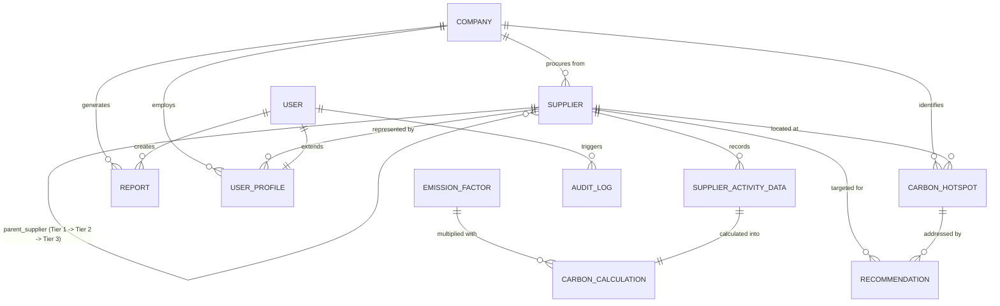

# SQLite Relational Database Design

## Carbon-Aware Supply Chain Dashboard

This document details the normalized relational database schema designed exclusively for **SQLite** (managed via Django ORM). It supports multi-tier Scope 3 carbon footprint tracking across companies and multi-tier supply networks.

---

## 1. Entity-Relationship Diagram (ERD)

---

## 2. Table Specifications

### 2.1 `companies` (`Company`)
Represents the reporting corporate enterprise measuring Scope 3 supply chain footprints.

| Column | Type | Constraints | Description |
|---|---|---|---|
| `id` | INTEGER | PRIMARY KEY AUTOINCREMENT | Unique company ID |
| `name` | VARCHAR(255) | NOT NULL, UNIQUE | Official enterprise name |
| `industry` | VARCHAR(100) | NOT NULL | Sector (e.g. Automotive, Tech, Apparel) |
| `country` | VARCHAR(100) | NOT NULL | Headquarters location |
| `registration_number` | VARCHAR(100) | NULLABLE | Legal/tax business registration |
| `reporting_year` | INTEGER | DEFAULT 2024 | Base or active reporting year |
| `target_reduction_pct` | DECIMAL(5,2) | DEFAULT 30.00 | Science-based target reduction percentage |
| `created_at` | TIMESTAMP | DEFAULT CURRENT_TIMESTAMP | Creation timestamp |
| `updated_at` | TIMESTAMP | AUTO UPDATE | Last update timestamp |

---

### 2.2 `user_profiles` (`UserProfile`)
Extends standard Django authentication `auth_user` with specific enterprise and supplier roles.

| Column | Type | Constraints | Description |
|---|---|---|---|
| `id` | INTEGER | PRIMARY KEY AUTOINCREMENT | Profile ID |
| `user_id` | INTEGER | NOT NULL, UNIQUE, FK -> `auth_user.id` | One-to-one user mapping |
| `role` | VARCHAR(20) | NOT NULL | `ADMIN`, `AUDITOR`, `SUPPLIER`, `VIEWER` |
| `company_id` | INTEGER | NULLABLE, FK -> `companies.id` | Associated enterprise |
| `supplier_id` | INTEGER | NULLABLE, FK -> `suppliers.id` | Associated supplier (when role = SUPPLIER) |
| `phone` | VARCHAR(30) | NULLABLE | Contact telephone |
| `created_at` | TIMESTAMP | DEFAULT CURRENT_TIMESTAMP | Creation timestamp |
| `updated_at` | TIMESTAMP | AUTO UPDATE | Last update timestamp |

---

### 2.3 `suppliers` (`Supplier`)
Represents supply chain vendors across multi-tier supplier networks.

| Column | Type | Constraints | Description |
|---|---|---|---|
| `id` | INTEGER | PRIMARY KEY AUTOINCREMENT | Unique supplier ID |
| `company_id` | INTEGER | NOT NULL, FK -> `companies.id` | Root enterprise client |
| `parent_supplier_id`| INTEGER | NULLABLE, FK -> `suppliers.id` | Parent vendor in the supply tier tree |
| `name` | VARCHAR(255) | NOT NULL | Business name of the supplier |
| `supplier_code` | VARCHAR(50) | NOT NULL | Identifier code (e.g., "SUP-101") |
| `tier_level` | INTEGER | NOT NULL, DEFAULT 1 | 1 = Tier 1, 2 = Tier 2, 3 = Tier 3 |
| `industry_sector` | VARCHAR(100) | NOT NULL | Sub-industry (e.g., Steel, Semiconductors) |
| `country` | VARCHAR(100) | NOT NULL | Facility / origin country |
| `contact_email` | VARCHAR(254) | NOT NULL | Point of contact email |
| `status` | VARCHAR(30) | DEFAULT 'ACTIVE' | `ACTIVE`, `INACTIVE`, `PENDING_VERIFICATION`|
| `created_at` | TIMESTAMP | DEFAULT CURRENT_TIMESTAMP | Creation timestamp |
| `updated_at` | TIMESTAMP | AUTO UPDATE | Last update timestamp |

> **Hierarchy Tree Rule**:
> - If `parent_supplier_id IS NULL` => **Tier 1 Supplier** (Supplies directly to `Company`).
> - If `parent_supplier_id` points to Tier 1 => **Tier 2 Supplier**.
> - If `parent_supplier_id` points to Tier 2 => **Tier 3 Supplier**.

---

### 2.4 `emission_factors` (`EmissionFactor`)
Reference greenhouse gas emission intensities (GHG Protocol, EPA, DEFRA).

| Column | Type | Constraints | Description |
|---|---|---|---|
| `id` | INTEGER | PRIMARY KEY AUTOINCREMENT | Unique factor ID |
| `activity_name` | VARCHAR(255) | NOT NULL | e.g., "Grid Electricity - US Average" |
| `category` | VARCHAR(50) | NOT NULL | `ELECTRICITY`, `TRANSPORT`, `MATERIAL`, `FUEL`, `WASTE` |
| `scope` | VARCHAR(50) | NOT NULL | e.g. "Scope 3 Cat 1", "Scope 3 Cat 4" |
| `unit` | VARCHAR(50) | NOT NULL | Activity measurement unit (kWh, tonne-km, kg) |
| `factor_value` | DECIMAL(12,6) | NOT NULL | kg CO2e per unit of activity |
| `source` | VARCHAR(150) | NOT NULL | Standard dataset source (DEFRA, EPA, etc.) |
| `region` | VARCHAR(100) | DEFAULT 'Global' | Geographical boundary |
| `year` | INTEGER | DEFAULT 2024 | Factor publication year |
| `created_at` | TIMESTAMP | DEFAULT CURRENT_TIMESTAMP | Record created |
| `updated_at` | TIMESTAMP | AUTO UPDATE | Record updated |

---

### 2.5 `supplier_activity_data` (`SupplierActivityData`)
Primary activity log reported by suppliers for Scope 3 emissions calculations.

| Column | Type | Constraints | Description |
|---|---|---|---|
| `id` | INTEGER | PRIMARY KEY AUTOINCREMENT | Unique activity record ID |
| `supplier_id` | INTEGER | NOT NULL, FK -> `suppliers.id` | Reporting supplier |
| `period_start` | DATE | NOT NULL | Reporting period start |
| `period_end` | DATE | NOT NULL | Reporting period end |
| `activity_type` | VARCHAR(100) | NOT NULL | Electricity, Diesel Road Transport, Steel Input, etc. |
| `quantity` | DECIMAL(15,4) | NOT NULL | Volume/amount of activity |
| `unit` | VARCHAR(50) | NOT NULL | Unit matching activity (e.g. kWh, km, liters) |
| `data_quality_score`| INTEGER | NOT NULL, DEFAULT 3 | 1 to 5 (5 = Primary auditable meter data) |
| `verification_status`| VARCHAR(30) | DEFAULT 'DRAFT' | `DRAFT`, `SUBMITTED`, `VERIFIED`, `REJECTED` |
| `submitted_by_id` | INTEGER | NULLABLE, FK -> `auth_user.id` | User who submitted the record |
| `notes` | TEXT | NULLABLE | Supplier notes or reference invoice |
| `created_at` | TIMESTAMP | DEFAULT CURRENT_TIMESTAMP | Submission timestamp |
| `updated_at` | TIMESTAMP | AUTO UPDATE | Modification timestamp |

---

### 2.6 `carbon_calculations` (`CarbonCalculation`)
Computed carbon footprint derived from multiplying activity data by emission factors.

| Column | Type | Constraints | Description |
|---|---|---|---|
| `id` | INTEGER | PRIMARY KEY AUTOINCREMENT | Unique calculation ID |
| `activity_data_id` | INTEGER | NOT NULL, UNIQUE, FK -> `supplier_activity_data.id` | One-to-one link to activity |
| `emission_factor_id`| INTEGER | NOT NULL, FK -> `emission_factors.id` | Matched emission factor |
| `co2e_kg` | DECIMAL(18,4) | NOT NULL | Calculated: `quantity * factor_value` |
| `co2e_tonnes` | DECIMAL(18,6) | NOT NULL | Calculated: `co2e_kg / 1000` |
| `calculation_method`| VARCHAR(50) | DEFAULT 'SUPPLIER_SPECIFIC' | `SUPPLIER_SPECIFIC`, `HYBRID`, `AVERAGE_DATA` |
| `status` | VARCHAR(30) | DEFAULT 'ESTIMATED' | `ESTIMATED`, `VERIFIED`, `AUDITED` |
| `calculated_at` | TIMESTAMP | DEFAULT CURRENT_TIMESTAMP | Calculation timestamp |
| `calculated_by_id` | INTEGER | NULLABLE, FK -> `auth_user.id` | Auditor or system actor |

---

### 2.7 `carbon_hotspots` (`CarbonHotspot`)
Aggregated emission clusters highlighting highest impact suppliers or supply tiers.

| Column | Type | Constraints | Description |
|---|---|---|---|
| `id` | INTEGER | PRIMARY KEY AUTOINCREMENT | Unique hotspot ID |
| `company_id` | INTEGER | NOT NULL, FK -> `companies.id` | Parent enterprise |
| `supplier_id` | INTEGER | NOT NULL, FK -> `suppliers.id` | High-emitting supplier |
| `tier_level` | INTEGER | NOT NULL | Supply tier (1, 2, 3) |
| `emission_category`| VARCHAR(100) | NOT NULL | Hotspot category (e.g. "Tier 2 Smelting") |
| `total_co2e_tonnes` | DECIMAL(15,4) | NOT NULL | Total footprint in metric tonnes |
| `contribution_pct` | DECIMAL(5,2) | NOT NULL | Percentage of overall supply footprint |
| `severity` | VARCHAR(20) | NOT NULL | `LOW`, `MEDIUM`, `HIGH`, `CRITICAL` |
| `identified_date` | DATE | NOT NULL | Date when hotspot was classified |
| `status` | VARCHAR(30) | DEFAULT 'OPEN' | `OPEN`, `IN_REVIEW`, `MITIGATED` |
| `created_at` | TIMESTAMP | DEFAULT CURRENT_TIMESTAMP | Record created |
| `updated_at` | TIMESTAMP | AUTO UPDATE | Record updated |

---

### 2.8 `recommendations` (`Recommendation`)
Actionable decarbonization and circular economy recommendations for identified hotspots.

| Column | Type | Constraints | Description |
|---|---|---|---|
| `id` | INTEGER | PRIMARY KEY AUTOINCREMENT | Unique recommendation ID |
| `hotspot_id` | INTEGER | NULLABLE, FK -> `carbon_hotspots.id` | Associated hotspot |
| `supplier_id` | INTEGER | NOT NULL, FK -> `suppliers.id` | Target supplier |
| `title` | VARCHAR(255) | NOT NULL | Brief action title |
| `description` | TEXT | NOT NULL | Detailed mitigation plan |
| `action_type` | VARCHAR(50) | NOT NULL | `RENEWABLE_ENERGY`, `CIRCULARITY`, `EFFICIENCY` |
| `potential_reduction_tonnes`| DECIMAL(15,4) | NOT NULL | Estimated CO2e saved |
| `cost_level` | VARCHAR(20) | DEFAULT 'MEDIUM' | `LOW`, `MEDIUM`, `HIGH`, `CAPEX_INTENSIVE` |
| `payback_period_years` | DECIMAL(4,1) | NULLABLE | Estimated financial payback |
| `status` | VARCHAR(30) | DEFAULT 'PROPOSED' | `PROPOSED`, `ACCEPTED`, `IN_PROGRESS`, `COMPLETED` |
| `created_at` | TIMESTAMP | DEFAULT CURRENT_TIMESTAMP | Created timestamp |
| `updated_at` | TIMESTAMP | AUTO UPDATE | Updated timestamp |

---

### 2.9 `audit_logs` (`AuditLog`)
Immutable regulatory trail tracking data revisions, recalculations, and verifications.

| Column | Type | Constraints | Description |
|---|---|---|---|
| `id` | INTEGER | PRIMARY KEY AUTOINCREMENT | Unique log ID |
| `user_id` | INTEGER | NULLABLE, FK -> `auth_user.id` | Actor who performed the action |
| `action` | VARCHAR(100) | NOT NULL | e.g. `DATA_SUBMITTED`, `CALCULATION_RUN` |
| `entity_type` | VARCHAR(100) | NOT NULL | Table or model name altered |
| `entity_id` | VARCHAR(50) | NOT NULL | Target record ID |
| `details` | JSON / TEXT | NOT NULL | Diff of changed fields or context |
| `ip_address` | VARCHAR(45) | NULLABLE | Origin IP address |
| `timestamp` | TIMESTAMP | DEFAULT CURRENT_TIMESTAMP | Exact action time |

---

### 2.10 `reports` (`Report`)
Scope 3 compliance summaries and disclosure documents.

| Column | Type | Constraints | Description |
|---|---|---|---|
| `id` | INTEGER | PRIMARY KEY AUTOINCREMENT | Unique report ID |
| `company_id` | INTEGER | NOT NULL, FK -> `companies.id` | Target company |
| `title` | VARCHAR(255) | NOT NULL | Title of report |
| `reporting_year` | INTEGER | NOT NULL | Fiscal or calendar reporting year |
| `total_scope3_tonnes`| DECIMAL(18,4) | NOT NULL | Total Scope 3 emissions |
| `tier1_emissions_tonnes`| DECIMAL(18,4) | NOT NULL | Breakdown for Tier 1 suppliers |
| `tier2_emissions_tonnes`| DECIMAL(18,4) | NOT NULL | Breakdown for Tier 2 suppliers |
| `tier3_emissions_tonnes`| DECIMAL(18,4) | NOT NULL | Breakdown for Tier 3 suppliers |
| `report_format` | VARCHAR(20) | DEFAULT 'JSON' | `JSON`, `PDF`, `CSV` |
| `status` | VARCHAR(30) | DEFAULT 'DRAFT' | `DRAFT`, `FINAL`, `PUBLISHED` |
| `generated_by_id` | INTEGER | NULLABLE, FK -> `auth_user.id` | User who generated report |
| `generated_at` | TIMESTAMP | DEFAULT CURRENT_TIMESTAMP | Generation timestamp |

---

## 3. SQLite Integrity & Normalization Guarantees

1. **Foreign Key Integrity**:
   - `PRAGMA foreign_keys = ON;` is enforced by Django's SQLite backend connection.
2. **Third Normal Form (3NF)**:
   - Emission factors are normalized into a master lookup table (`emission_factors`) avoiding duplicate factor strings.
   - Activity data (`supplier_activity_data`) is strictly isolated from calculations (`carbon_calculations`), enabling recalculation when factors change without corrupting historical audit data.
   - Supplier hierarchy is represented via self-referential parent links (`parent_supplier_id`), preventing redundant multi-table hierarchy duplication.
